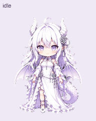

[简体中文](README.md) | [日本語](README.ja.md) | [English](README.en.md)

# GPT Dragon Girl

An animated work companion with white hair, purple eyes, and pale purple dragon wings. Based on character references supplied by the user, with slightly wider wings, nine action states, and sixteen gaze directions.

## Files

- `assets/spritesheet.png`: final transparent PNG sprite sheet, usable in Pets import workflows that support this layout.
- `pet.json`: name, description, dimensions, action order, and SHA-256.
- `previews/`: nine actions, gaze loop, idle-to-jump transition, complete GIF/MP4 animations, and a four-frame still demonstration.
- `docs/contact-sheet.png`: labeled overview of all frames.
- `docs/direction-sheet.png`: overview of sixteen gaze directions.
- `validation/`: final structure, quality, direction, and background-cleanup checks.
- `checksums.sha256`: integrity checksums for package files.

## Sprite-sheet layout

v2 layout: 1536 × 2288 px; 8 columns × 11 rows; each cell 192 × 208 px. There are 73 valid frames, with 15 unused cells remaining transparent. Each row is filled from the left.

| Row (starting at 0) | State | Frames |
| --- | --- | ---: |
| 0 | idle | 6 |
| 1 | running-right | 8 |
| 2 | running-left | 8 |
| 3 | waving | 4 |
| 4 | jumping | 5 |
| 5 | failed / failure response | 8 |
| 6 | waiting / awaiting a response | 6 |
| 7 | running / thinking and working | 6 |
| 8 | review / checking results | 6 |
| 9 | gaze 000° → 157.5° | 8 |
| 10 | gaze 180° → 337.5° | 8 |

Gaze uses screen coordinates: 000° up, 090° right, 180° down, and 270° left. Frames advance clockwise in 22.5° steps.

## Use

Upload this folder's contents to the repository root on GitHub. Clients supporting this sprite-sheet format should read `assets/spritesheet.png`. GitHub stores and displays files; it does not automatically install or select a pet.

## Production and validation

The built-in imagegen tool generated the character and separate action strips. Scripts bundled with the Pets skill extracted and assembled frames, cleaned backgrounds, and validated the result. The final sheet passed v2 structure validation, quality checks, a majority direction assessment by three independent reviewers, and Pets service preflight checks. Differences between some adjacent diagonal poses are subtle; details remain in the validation reports.

The package excludes account pet IDs, upload sessions, temporary download links, local absolute paths, original references, and discarded intermediate versions. `workflow/` paths in reports record production provenance; they do not mean those intermediate files are included.

## Licensing

No open-source license has been specified. The user supplied the character reference. This package does not claim copyright ownership of that reference or character, and does not automatically grant redistribution or commercial-use permission.
